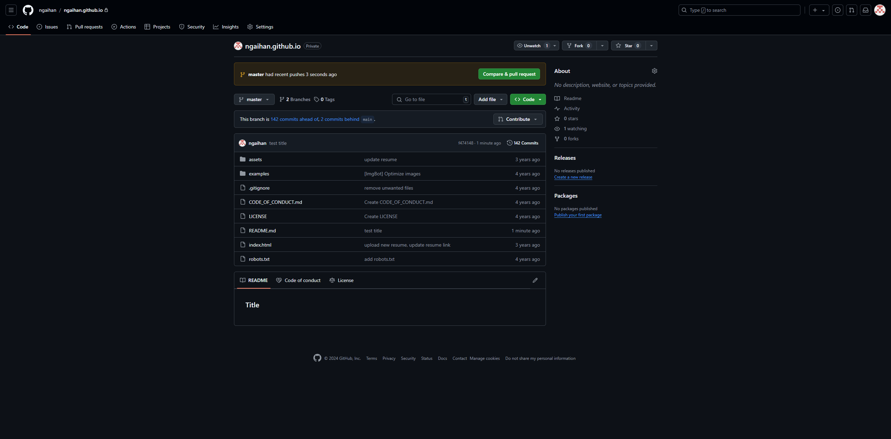
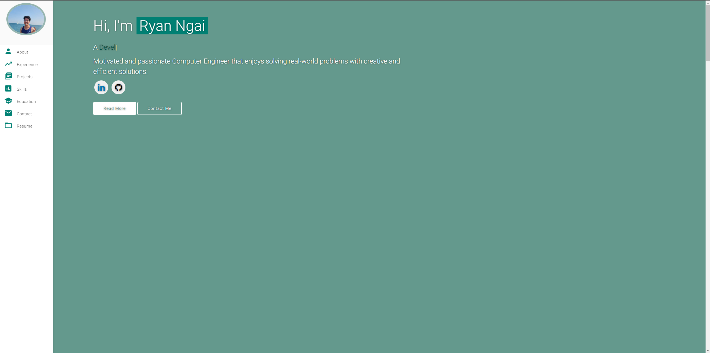
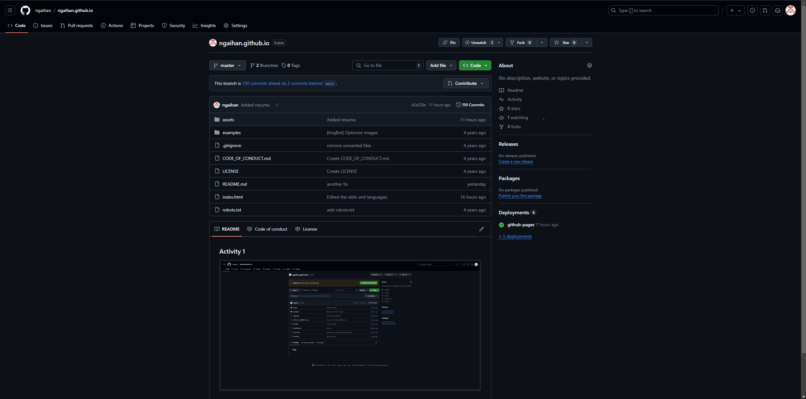
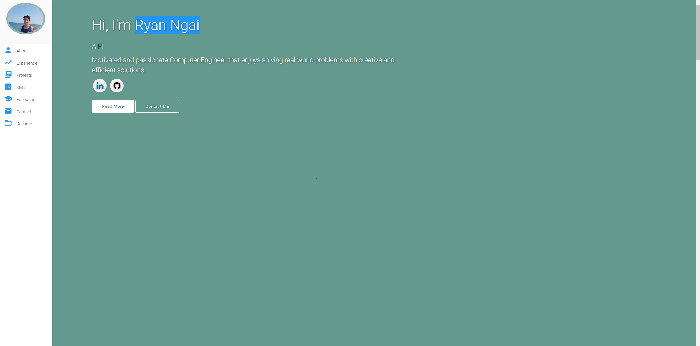
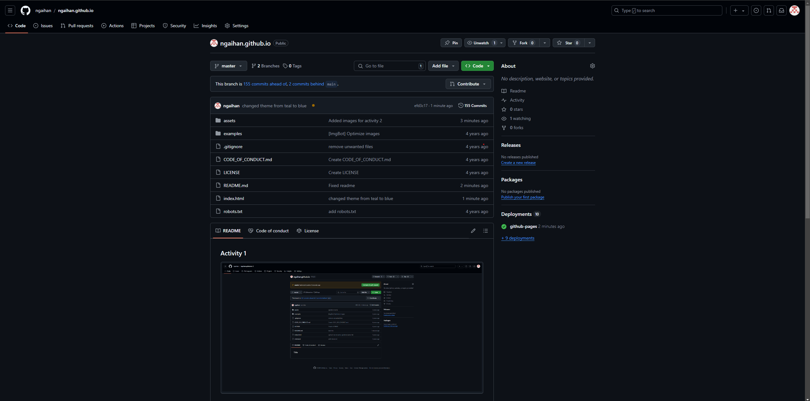
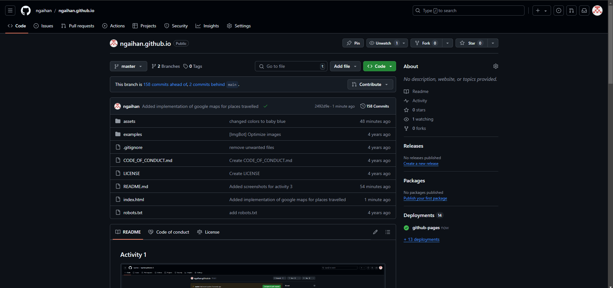

### Activity 1

 
  <kbd>
    
  </kbd>

### Activity 2

 
  <kbd>
    
  </kbd>

 
  <kbd>
    
  </kbd>

### Activity 3

 
  <kbd>
    
  </kbd>

 
  <kbd>
    
  </kbd>

### Activity 4

 
  <kbd>
    
  </kbd>

 
  <kbd>
    
  </kbd>

